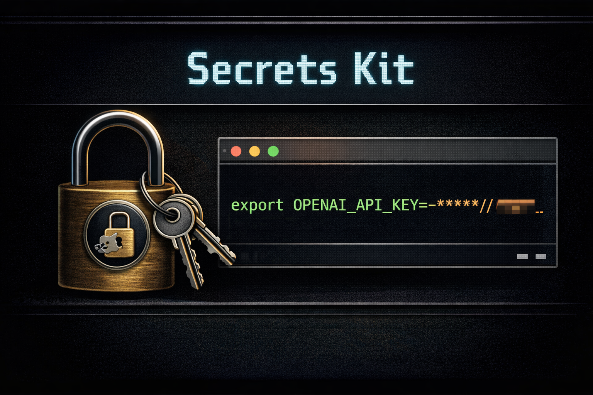

# Secrets Kit - "stop painting API keys on argv" release



[](#requirements) [](#requirements) [](LICENSE)

**Repository:** `Secrets-Kit` · **CLI:** `seckit` · **Current release target:** `v1.2.3`

Secrets Kit is a **macOS** CLI that stores secret values in the **login Keychain**, keeps **metadata on the keychain item** (comment JSON), and uses **`~/.config/seckit/registry.json`** only as an index/recovery aid—not the source of truth. It can **inject** selected secrets into child processes via `seckit run` and **export** shell/dotenv or encrypted backups.

## Scope and limits (read first)

| In scope | Out of scope |
|----------|----------------|
| macOS, Python 3.9+, `security` + login Keychain | Hosted vault, HSM, zero-knowledge guarantees |
| **Primary cross-host:** `seckit export` / **`import`** (e.g. **encrypted JSON**) + you move the file | Phone home; your Keychain password is never read by the tool |
| `seckit run`, import/export, encrypted cross-host backup | Deprecated **`icloud`** backends (removed); live multi-master “sync” guarantees; **iCloud Drive does not replace Keychain** (see docs); protection on an already-compromised machine/session |

If that trust model is unclear, use something else until it is.

## Install

```bash
pip install "git+https://github.com/unixwzrd/Secrets-Kit.git@v1.2.3#egg=seckit"
```

Development checkout: `pip install -e .` in a venv. For day-to-day use, **`--backend secure`** is sufficient (no helper). Wheels still bundle **`seckit-keychain-helper`** for the **legacy, unsupported** **`--backend icloud`** path; see [iCloud Sync Validation](docs/ICLOUD_SYNC_VALIDATION.md). **Reliable host-to-host transfer:** [Cross-Host Validation](docs/CROSS_HOST_VALIDATION.md) (encrypted export).

```bash
seckit version
```

## First commands

```bash
seckit keychain-status
seckit unlock
echo 'example' | seckit set --name DEMO_KEY --stdin --kind generic --service my-stack --account local-dev
seckit list --service my-stack --account local-dev
seckit run --service my-stack --account local-dev -- python3 -c 'import os; print("DEMO" in os.environ)'
```

**Longer walkthrough:** [Quickstart](docs/QUICKSTART.md)

## Defaults and config file

Avoid repeating `--service` / `--account` via `~/.config/seckit/defaults.json` or `SECKIT_DEFAULT_*`. Edit from the CLI: `seckit config set …`, `seckit config show` ([Defaults](docs/DEFAULTS.md)). **`registry.json` is metadata only**, not CLI defaults.

## Documentation

| Audience | Start here |
|----------|------------|
| Everyone | [Documentation index](docs/README.md) |
| Day-to-day use | [Quickstart](docs/QUICKSTART.md) · [Usage](docs/USAGE.md) · [Defaults](docs/DEFAULTS.md) |
| Security posture | [Security model](docs/SECURITY_MODEL.md) |
| Agents / apps | [Integrations](docs/INTEGRATIONS.md) · [Examples](docs/EXAMPLES.md) |
| iCloud / signing | [iCloud Sync Validation](docs/ICLOUD_SYNC_VALIDATION.md) · [Two-host manual checklist](docs/plans/icloud-two-host-checklist.md) |
| Wheels / release | [GitHub release build](docs/GITHUB_RELEASE_BUILD.md) |
| Deep dives | [Metadata registry](docs/METADATA_REGISTRY.md) · [Cross-host validation](docs/CROSS_HOST_VALIDATION.md) |

## Contributing

Issues and PRs welcome (CLI UX, backends, docs, import/export edge cases). Local checks:

```bash
bash ./scripts/run_local_validation.sh
```

**Updated:** 2026-05-05

---

## Support / license

- [Patreon](https://patreon.com/unixwzrd) · [Ko-Fi](https://ko-fi.com/unixwzrd) · [Buy Me a Coffee](https://buymeacoffee.com/unixwzrd)

Copyright 2026 [unixwzrd@unixwzrd.ai](mailto:unixwzrd@unixwzrd.ai) — [MIT License](LICENSE)
