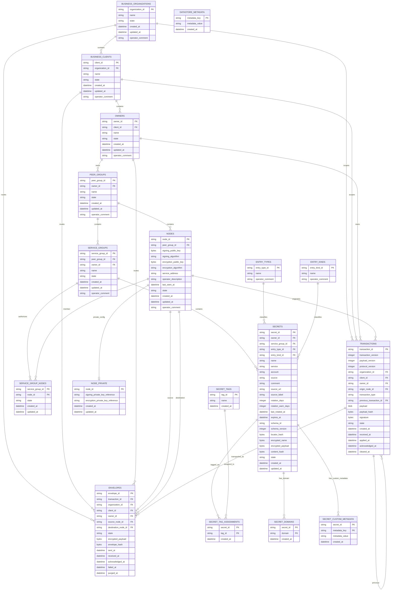

# Local-First Datastore Architecture

**Created**: 2026-05-21
**Updated**: 2026-07-22
**Status**: Authoritative relational architecture

- [Local-First Datastore Architecture](#local-first-datastore-architecture)
  - [Status And Scope](#status-and-scope)
  - [Identity And Naming Policy](#identity-and-naming-policy)
  - [Authoritative Relational ERD](#authoritative-relational-erd)
  - [Entity Definitions](#entity-definitions)
    - [`business_organizations`](#business_organizations)
    - [`business_clients`](#business_clients)
    - [`owners`](#owners)
    - [`peer_groups`](#peer_groups)
    - [`nodes`](#nodes)
    - [`node_private`](#node_private)
    - [`service_groups`](#service_groups)
    - [`service_group_nodes`](#service_group_nodes)
    - [`entry_types`](#entry_types)
    - [`entry_kinds`](#entry_kinds)
    - [`secrets`](#secrets)
    - [`secret_tags`](#secret_tags)
    - [`secret_tag_assignments`](#secret_tag_assignments)
    - [`secret_domains`](#secret_domains)
    - [`secret_custom_metadata`](#secret_custom_metadata)
  - [Secret Projection Surfaces](#secret-projection-surfaces)
  - [Transaction Model](#transaction-model)
    - [`transactions`](#transactions)
  - [Envelope Model](#envelope-model)
    - [`envelopes`](#envelopes)
  - [Routing Model](#routing-model)
  - [State Models](#state-models)
  - [Architecture Authority](#architecture-authority)

## Status And Scope

This document defines the authoritative relational data model for the
Secrets-Kit SQLite datastore.

The relational model is the source of truth for datastore entities, attributes, relationships, cardinality, routing scope, transaction persistence, and envelope persistence. Dataclasses, views, APIs, transaction payloads, CLI commands, daemon code, synchronization code, transport code, and cryptographic code are derived from this relational model and may not redefine it.

The model is:

- relational data model
- orthogonal modules
- orchestration layer

It is not an object-model-first persistence design.

All authoritative datastore mutations enter through canonical transactions.
CLI producer paths, daemon synchronization paths, future MCP/API paths, and future transport paths may not directly mutate projection tables. Projection rows are derived from accepted transactions.

Provisioning, opening, validation, and runtime are distinct responsibilities. `seckit init` provisions the SQLite datastore, including schema, datastore metadata, storage keys where required, node identity, and local-node projection state. Opening an existing datastore opens a connection only. Validation is read-only and must refuse invalid state rather than creating, repairing, or modifying persistent objects.

Each SQLite datastore records an immutable local storage mode as datastore metadata at initialization. Supported modes are `encrypted` and `plaintext`. `encrypted` is the default and uses the local SQLite storage key for name and payload bytes. `plaintext` is explicit, stores canonical name and payload bytes unencrypted in the same transaction/projection fields, and is intended for controlled local synchronization testing before authenticated peer-envelope encryption exists. Runtime reads the mode from SQLite metadata; defaults cannot override an initialized database.

Testing boundaries:

- producer tests verify CLI commands create correct transactions;
- transaction-engine tests may inject canonical transactions directly;
- replication tests may inject transactions or envelopes into isolated local node instances;
- transport tests verify delivery independently of projection semantics;
- end-to-end tests prove CLI-originated mutations traverse the same canonical transaction/envelope path.

The current local multi-node synchronization tests exercise isolated SQLite nodes on one machine with runtime-assigned daemon TCP endpoints. Configured addresses are bootstrap hints only. They do not demonstrate cross-host P2P, RSS, discovery, NAT traversal, signed/encrypted general envelopes, or hosted RSS behavior. Local authenticated peer admission and public-key exchange through signed admission artifacts are demonstrated.

## Identity And Naming Policy

Protocol-visible datastore and protocol objects use immutable UUID-backed typed identifiers. Human-facing names are mutable projections and must not be used for routing, authorization, admission, replay, reconciliation, or hosted billing linkage.

The compact typed identifier policy is defined in [PROTOCOL_IDENTITY_AND_NAMING_ADR.md](PROTOCOL_IDENTITY_AND_NAMING_ADR.md). `display_name` is mutable and not globally unique. `operator_comment` is a local note, not identity. `alias`, if supported, is local-only convenience metadata unless a later ADR changes that.

Local/P2P domain objects include organization, client/customer, owner, peer group, service group, and node. `Entity` remains unresolved; this document does not create an entity table or lifecycle.

Current relational columns named `name` represent display metadata unless a table-specific rule says otherwise. They are not protocol identities, are not globally unique, and must not be used for routing, authorization, admission, signing, encryption, replay, reconciliation, or hosted billing linkage. ID-02 keeps the existing schema names and records any broad `name` to `display_name` column rename as a separate explicit migration concern.

Standalone SQLite provisioning creates the required local hierarchy support rows through one canonical local hierarchy path. The initialized node receives its own `node:<uuid>` identity, and its local peer group is a distinct `pg:<uuid>` derived from that node id. Replay support and normal local CRUD support rows use the same hierarchy algorithms so local bootstrap rows do not introduce alternate protocol identities. Runtime open, validation, replay, daemon startup, and synchronization do not silently rewrite existing hierarchy identifiers.

Hosted operational objects such as relay account, billing account, subscription, entitlement, provisioning record, invoice recipient, and usage record may reference local typed UUIDs deliberately, but they are not cryptographic node identity, local datastore authority, peer admission authority, transaction authority, or reconciliation authority.

## Authoritative Relational ERD

The following Mermaid ERD is the authoritative relational data model for Secrets-Kit.

## Entity Definitions

### `business_organizations`

Business organizations are the top-level business scope.

Fields:

- `organization_id` (primary key)
- `name`
- `state`
- `created_at`
- `updated_at`
- `operator_comment`

Relationships:

- contains zero or more `business_clients`
- scopes zero or more `transactions`
- routes zero or more `envelopes`

### `business_clients`

Business clients belong to a business organization.

Fields:

- `client_id` (primary key)
- `organization_id` (foreign key to `business_organizations.organization_id`)
- `name`
- `state`
- `created_at`
- `updated_at`
- `operator_comment`

Relationships:

- belongs to one `business_organization`
- contains zero or more `owners`
- scopes zero or more `transactions`
- routes zero or more `envelopes`

### `owners`

Owners belong to a business client and own peer groups, secrets, and transaction scope.

Fields:

- `owner_id` (primary key)
- `client_id` (foreign key to `business_clients.client_id`)
- `name`
- `state`
- `created_at`
- `updated_at`
- `operator_comment`

Relationships:

- belongs to one `business_client`
- owns zero or more `peer_groups`
- owns zero or more `transactions`
- routes zero or more `envelopes`

### `peer_groups`

Peer groups are owner-scoped node groupings.

The `name` field is display metadata. It is not identity and duplicate peer-group display names are permitted. Initial local peer-group display names are generated convenience values; uniqueness and protocol routing come only from `peer_group_id`.

Fields:

- `peer_group_id` (primary key)
- `owner_id` (foreign key to `owners.owner_id`)
- `name`
- `state`
- `created_at`
- `updated_at`
- `operator_comment`

Relationships:

- belongs to one `owner`
- contains zero or more `nodes`
- contains zero or more `service_groups`

### `nodes`

Nodes are protocol identities in a peer group. Each datastore represents one node, and that node is represented by a row in `nodes`. A node may have zero or more current operational endpoints over its lifetime; an endpoint is not node identity and is not durable application authority.

The node identifier is protocol identity. `operator_description`, `operator_comment`, and any future alias-like metadata are operator-facing convenience data and must not be used for protocol routing, authorization, admission, signing, encryption, replay, or reconciliation.

Fields:

- `node_id` (primary key)
- `peer_group_id` (foreign key to `peer_groups.peer_group_id`)
- `signing_public_key`
- `signing_algorithm`
- `encryption_public_key`
- `encryption_algorithm`
- `authorization_mode`
- `service_address` (legacy/compatibility endpoint hint; not routing authority)
- `operator_description`
- `last_seen_at`
- `state`
- `created_at`
- `updated_at`
- `operator_comment`

Relationships:

- belongs to one `peer_group`
- may have one `node_private` row in this datastore
- may be a member of zero or more `service_group_nodes`
- uses explicit synchronization authorization mode: `none`, `allow_list`, or `all`
- originates zero or more `transactions`
- may be the source of zero or more `envelopes`
- may be the destination of zero or more `envelopes`

The Peer Registry persists endpoint lifecycle records keyed by peer identity.
Registration, update/replacement, expiration, and removal are canonical transactions replayed into `peer_endpoints`; these records are last-known runtime metadata, not authorization. The daemon owns only the active listener, reachability, and in-memory route cache. Those operational values must tolerate daemon restart, dynamic port rebinding, DHCP changes, and sleep/wake. The compatibility `service_address` projection may retain a last-known value, but runtime routing must not infer admission or synchronization authorization from it.

### `node_private`

Node private configuration stores datastore-private key references for a node.
It stores references only, not raw private keys.

Fields:

- `node_id` (primary key and foreign key to `nodes.node_id`)
- `signing_private_key_reference`
- `encryption_private_key_reference`
- `created_at`
- `updated_at`

Relationship:

- belongs to one `node`

### `service_groups`

Service groups define which nodes receive secret updates for a scoped service distribution group.

Fields:

- `service_group_id` (primary key)
- `peer_group_id` (foreign key to `peer_groups.peer_group_id`)
- `owner_id` (foreign key to `owners.owner_id`)
- `name`
- `state`
- `created_at`
- `updated_at`
- `operator_comment`

Relationships:

- belongs to one `peer_group`
- belongs to one `owner`
- authorizes zero or more `service_group_nodes`
- contains zero or more `secrets`

### `service_group_nodes`

Service-group membership authorizes nodes to receive updates for a service group when the peer's synchronization authorization mode is `allow_list`. Missing `service_group_nodes` rows do not imply wildcard authorization.

Fields:

- `service_group_id` (composite primary key and foreign key to `service_groups.service_group_id`)
- `node_id` (composite primary key and foreign key to `nodes.node_id`)
- `state`
- `created_at`
- `updated_at`

Relationships:

- belongs to one `service_group`
- belongs to one `node`

### `entry_types`

Entry types classify secrets by high-level type.

Fields:

- `entry_type_id` (primary key)
- `name`
- `operator_comment`

Relationship:

- classifies zero or more `secrets`

### `entry_kinds`

Entry kinds classify secrets by concrete kind.

Fields:

- `entry_kind_id` (primary key)
- `name`
- `operator_comment`

Relationship:

- classifies zero or more `secrets`

### `secrets`

Secrets are owner-scoped entries assigned to service groups. The relational projection fields on `secrets` support deterministic lookup, listing, replay, and rebuild behavior.

Fields:

- `secret_id` (primary key)
- `owner_id` (foreign key to `owners.owner_id`)
- `service_group_id` (foreign key to `service_groups.service_group_id`)
- `entry_type_id` (foreign key to `entry_types.entry_type_id`)
- `entry_kind_id` (foreign key to `entry_kinds.entry_kind_id`)
- `name`
- `service`
- `account`
- `source`
- `comment`
- `source_url`
- `source_label`
- `rotation_days`
- `rotation_warn_days`
- `last_rotated_at`
- `expires_at`
- `schema_id`
- `schema_version`
- `locator_hash`
- `encrypted_name`
- `encrypted_payload`
- `content_hash`
- `state`
- `created_at`
- `updated_at`

Relationships:

- belongs to one `owner`
- belongs to one `service_group`
- belongs to one `entry_type`
- belongs to one `entry_kind`

The `encrypted_name` and `encrypted_payload` column names are stable storage fields. In encrypted mode they contain versioned encrypted blob records. In plaintext mode they contain plaintext bytes by explicit datastore choice; the transaction pipeline, projection pipeline, and replay semantics remain the same.
- may have zero or more `secret_tag_assignments`
- may have zero or more `secret_domains`
- may have zero or more `secret_custom_metadata` rows

### `secret_tags`

Secret tags are relational query labels assignable to secrets.

Fields:

- `tag_id` (primary key)
- `name`
- `created_at`

Relationship:

- may be assigned to zero or more `secrets` through `secret_tag_assignments`

### `secret_tag_assignments`

Secret tag assignments are the relationship between secrets and tags.

Fields:

- `secret_id` (composite primary key and foreign key to `secrets.secret_id`)
- `tag_id` (composite primary key and foreign key to `secret_tags.tag_id`)
- `created_at`

Relationships:

- belongs to one `secret`
- belongs to one `secret_tag`

### `secret_domains`

Secret domains are relational query values associated with a secret.

Fields:

- `secret_id` (composite primary key and foreign key to `secrets.secret_id`)
- `domain` (composite primary key)
- `created_at`

Relationship:

- belongs to one `secret`

### `secret_custom_metadata`

Secret custom metadata stores explicit key/value projection rows for secrets.
These rows are relational query surfaces, not a generic datastore metadata store.

Fields:

- `secret_id` (composite primary key and foreign key to `secrets.secret_id`)
- `metadata_key` (composite primary key)
- `metadata_value`
- `created_at`

Relationship:

- belongs to one `secret`

## Secret Projection Surfaces

The projection fields on `secrets` and the `secret_tags`,
`secret_tag_assignments`, `secret_domains`, and `secret_custom_metadata` tables exist so CLI, list, search, replay, and rebuild flows can query and reconstruct secret state deterministically from relational tables.

These surfaces are not compatibility tables, an object model, a schema registry, or a generic datastore metadata store. In production, sensitive projection values may later be encrypted, blinded, or hashed, but the relational shape remains authoritative.

## Transaction Model

### `transactions`

Transactions are durable state-change records.

Fields:

- `transaction_id` (primary key)
- `transaction_version`
- `payload_version`
- `protocol_version`
- `organization_id` (foreign key to `business_organizations.organization_id`)
- `client_id` (foreign key to `business_clients.client_id`)
- `owner_id` (foreign key to `owners.owner_id`)
- `origin_node_id` (foreign key to `nodes.node_id`)
- `transaction_type`
- `previous_transaction_id` (foreign key to `transactions.transaction_id`)
- `payload`
- `payload_hash`
- `signature`
- `state`
- `created_at`
- `received_at`
- `applied_at`
- `acknowledged_at`
- `cleared_at`

Relationships:

- belongs to one business organization scope
- belongs to one business client scope
- belongs to one owner scope
- originates from one node
- may reference one previous transaction
- may be transported by zero or more `envelopes`

State timestamps:

- `created_at` records local transaction creation.
- `received_at` records receipt from another node.
- `applied_at` records successful application to local state.
- `acknowledged_at` records acknowledgement.
- `cleared_at` records local clearing or retention completion.

## Envelope Model

### `envelopes`

Envelopes are durable transport records for transactions.

Fields:

- `envelope_id` (primary key)
- `transaction_id` (foreign key to `transactions.transaction_id`)
- `organization_id` (foreign key to `business_organizations.organization_id`)
- `client_id` (foreign key to `business_clients.client_id`)
- `owner_id` (foreign key to `owners.owner_id`)
- `source_node_id` (foreign key to `nodes.node_id`)
- `destination_node_id` (foreign key to `nodes.node_id`)
- `state`
- `encrypted_payload`
- `envelope_hash`
- `sent_at`
- `received_at`
- `acknowledged_at`
- `failed_at`
- `purged_at`

Relationships:

- transports one transaction
- belongs to one business organization routing scope
- belongs to one business client routing scope
- belongs to one owner routing scope
- has one source node
- has one destination node

State timestamps:

- `sent_at` records outbound send time.
- `received_at` records inbound receive time.
- `acknowledged_at` records acknowledgement.
- `failed_at` records failed delivery.
- `purged_at` records local purge.

## Routing Model

Routing is determined by relational scope:

- `business_organizations` scope transactions and envelopes.
- `business_clients` scope transactions and envelopes.
- `owners` own peer groups and scope transactions and envelopes.
- `peer_groups` contain nodes and service groups.
- `service_groups` contain secrets.
- `service_group_nodes` authorizes which nodes receive updates for a service group when a peer is in `allow_list` mode; `none` denies service-group-scoped synchronization and `all` is the only explicit wildcard.
- `envelopes.source_node_id` and `envelopes.destination_node_id` identify transport source and destination nodes.

## State Models

State fields are ordinary relational lifecycle fields. Implementations must use explicit state values appropriate to each table and must keep lifecycle timestamps in the table that owns the state transition.

Tables with `state`:

- `business_organizations`
- `business_clients`
- `owners`
- `peer_groups`
- `nodes`
- `service_groups`
- `service_group_nodes`
- `secrets`
- `transactions`
- `envelopes`

## Architecture Authority

The architecture authority order is:

1. this document
2. the embedded Mermaid ERD
3. implementation-specific design documents
4. source code

If a lower-level artifact conflicts with this document, the lower-level artifact must be corrected or this document must be intentionally revised.
