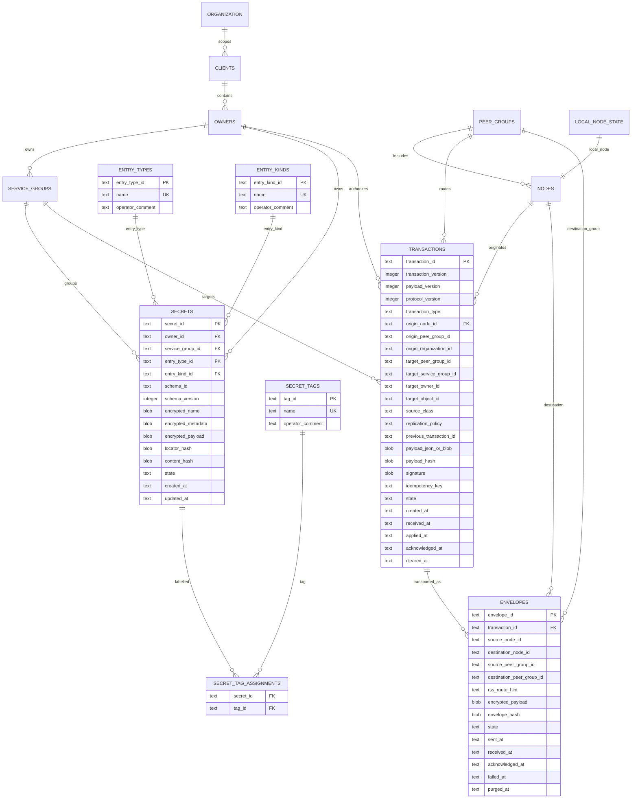

# SQLite Canonical Relational Schema

**Created**: 2026-05-21
**Updated**: 2026-05-25

- [SQLite Canonical Relational Schema](#sqlite-canonical-relational-schema)
  - [Status And Scope](#status-and-scope)
  - [Core Architecture Principles](#core-architecture-principles)
  - [Simplified Canonical Model](#simplified-canonical-model)
    - [`organization`](#organization)
    - [`clients`](#clients)
    - [`owners`](#owners)
    - [`service_groups`](#service_groups)
    - [`peer_groups`](#peer_groups)
    - [`nodes`](#nodes)
    - [`secrets`](#secrets)
    - [`transactions`](#transactions)
    - [`envelopes`](#envelopes)
    - [`local_node_state`](#local_node_state)
  - [Typed Secure Object Model](#typed-secure-object-model)
  - [Revised Mermaid ERD](#revised-mermaid-erd)
  - [SQLite Typing And Storage Conventions](#sqlite-typing-and-storage-conventions)
  - [Transaction Lifecycle](#transaction-lifecycle)
  - [Canonical Transaction Payload Model](#canonical-transaction-payload-model)
  - [Layered Payload Architecture](#layered-payload-architecture)
  - [Envelope Lifecycle](#envelope-lifecycle)
  - [Encryption And Plaintext Handling](#encryption-and-plaintext-handling)
  - [Cryptographic Separation Principles](#cryptographic-separation-principles)
  - [Store Unlock And Key Handling](#store-unlock-and-key-handling)
  - [Synchronization Notes](#synchronization-notes)
  - [Replay And Recovery](#replay-and-recovery)
  - [Simplified Relational Projections](#simplified-relational-projections)
  - [Explicit Non-Goals](#explicit-non-goals)
  - [Unresolved Semantic Questions](#unresolved-semantic-questions)
  - [Implementation Posture](#implementation-posture)

## Status And Scope

This document is the canonical SQLite schema architecture note for the simplified transaction-first operational model.

The previous over-normalized schema direction and prior DOT reconciliation direction are superseded. Do not incrementally reconcile future work against the earlier generated schema. Rebuild implementation work around the transaction-first model described here.

This document is the architecture authority for bounded SQLite implementation work. It does not authorize migrations, ORM models, repository layers, daemon behavior, CLI behavior, sync implementation, transport implementation, crypto changes, or Keychain behavior changes without a separate scoped implementation pass.

[OBJECT_MODEL_AND_SCHEMA_SEMANTICS.md](OBJECT_MODEL_AND_SCHEMA_SEMANTICS.md) is the semantic authority for object identity, transaction lineage, projection semantics, hashing boundaries, locator semantics, authoritative state, lifecycle vocabulary, and future replay invariants.

SQLite has no released production encrypted database format. Current SQLite support is a bounded developer-mode CLI backend under `src/secrets_kit/backends/sqlite/`: explicit connection setup, schema bootstrap, deterministic transaction serialization and hashing, append-only transaction insertion, local replay for supported projection types, and standalone CLI `set` / `get` / `list` / `delete` flows. SQLite is not production storage for secret material until encryption-at-rest is implemented.

SQLite remains a local operational datastore. Transaction replay and synchronization semantics are layered above SQLite; SQLite itself is not treated as a distributed replication engine.

## Core Architecture Principles

Current-state projections are derived exclusively through validated transaction application logic.

SQLite triggers may be used for append-only enforcement, immutable-row protection, timestamp maintenance, or projection consistency guardrails, but triggers are not the primary business-logic engine for synchronization, replay, routing, quorum, rollback, or reconciliation semantics.

Replay, reconciliation, and transaction application semantics belong to explicit application logic.

Transactions are the canonical durable history, audit, and replay mechanism. Current-state relational tables are materialized operational projections derived from accepted transactions.

All persistent state transitions enter the system through validated transactions:

- CLI, API, and runtime operations create transactions.
- Peer synchronization ingests transactions.
- The CLI must not directly mutate current-state tables.
- Peer synchronization must not directly mutate current-state tables.
- Accepted transactions materialize current operational state.

Envelopes are transport wrappers for peer delivery only. Envelopes are not canonical history. Transaction history remains authoritative after envelopes are retransmitted, acknowledged, failed, or purged.

Synchronization intermediaries may route envelopes and validate envelope metadata. Synchronization intermediaries must not decrypt transaction contents and must not access secret plaintext.

Consensus is lightweight acknowledgment and validation only. This is not a Raft, Paxos, distributed-locking, or distributed-consensus database architecture.

The architecture prioritizes operational simplicity, transaction replay capability, auditability, local-first authority, lightweight synchronization, reduced relational complexity, and workflow clarity over strict normalization.

Rollback or invalidation should be represented as compensating or corrective transactions which supersede prior operational state without mutating historical transaction records.

Do not reintroduce highly decomposed one-to-one relational structures unless there is a strong operational justification. One-to-one tables should generally be folded together.

## Simplified Canonical Model

### `organization`

Top-level local operational scope.

Fields:

- `organization_id`
- `operator_comment`

### `clients`

Organization-scoped client or workspace boundary. This is local attribution and operational grouping, not SaaS billing architecture.

Fields:

- `client_id`
- `organization_id`
- `operator_comment`

### `owners`

Client-scoped authority or ownership boundary for local operational use.

Fields:

- `owner_id`
- `client_id`
- `operator_comment`

### `service_groups`

Owner-scoped grouping for secrets and operational targeting.

Fields:

- `service_group_id`
- `owner_id`
- `operator_comment`

### `peer_groups`

Peer delivery and reconciliation grouping.

Fields:

- `peer_group_id`
- `operator_comment`

### `nodes`

Peer or local node identity and public key material.

Initial implementations assume one primary peer group per local datastore and runtime identity boundary. Separate users, daemon instances, or operational namespaces should use separate local stores, node identities, and synchronization domains.

Future membership expansion or multi-peer-group federation, if required, should be introduced deliberately with explicit synchronization, routing, and authorization semantics.

Fields:

- `node_id`
- `peer_group_id`
- `public_key`
- `operator_comment`

### `entry_types`

Vocabulary of **broad secure-object categories** (what class of thing is stored). These are operator-facing **tags at the category level**, not JSON metadata schema descriptors (`schema_id`).

Examples: `secret` (credentials and API material), `pii` (personally identifiable information).

Fields:

- `entry_type_id` (primary key, UUID)
- `name` (unique human label, e.g. `secret`, `pii`)
- `operator_comment`

### `entry_kinds`

Vocabulary of **narrow subtypes** within a category (how the object is interpreted operationally).

Examples: `api_key`, `password`, `token`, `email`, `credit_card`, `generic`.

`entry_kind` answers “what shape is this?” (API key vs password vs token). `entry_type` answers “what policy bucket?” (secret vs pii). Both are normalized reference data; the `secrets` row stores **UUID foreign keys** (`entry_type_id`, `entry_kind_id`). CLI and transaction payloads continue to use the string **names**; projection resolves name → UUID.

Fields:

- `entry_kind_id` (primary key, UUID)
- `name` (unique human label, e.g. `api_key`, `password`)
- `operator_comment`

Built-in rows are seeded at database bootstrap. New labels may be inserted when a secret is written with a novel type/kind (developer store).

### `secret_tags` and `secret_tag_assignments`

Free-form **labels** (same concept as Keychain/JSON metadata `tags: []`) normalized for query and referential integrity.

- `secret_tags` — one row per distinct tag (`tag_id` UUID PK, unique `name`). In developer mode the name may be stored in clear; production persistence should move to blind indexes or encrypted tag material per the production rule below.
- `secret_tag_assignments` — many-to-many link between `secrets.secret_id` and `secret_tags.tag_id` (both UUIDs).

Tags are also retained inside `encrypted_metadata` on the secret projection so CLI roundtrip matches Keychain behavior; the assignment table is the relational index.

### `secrets`

Encrypted current-state projection derived from accepted transactions. This table is not canonical history. It is rebuildable from accepted transaction history.

Fields:

- `secret_id`
- `owner_id`
- `service_group_id`
- `entry_type_id` (FK → `entry_types.entry_type_id`, UUID)
- `entry_kind_id` (FK → `entry_kinds.entry_kind_id`, UUID)
- `schema_id` (optional JSON metadata schema descriptor id — **not** the same as entry type/kind)
- `schema_version` (descriptor revision for `schema_id`)
- `locator_hash`
- `encrypted_name`
- `encrypted_metadata`
- `encrypted_payload`
- `content_hash`
- `state`
- `created_at`
- `updated_at`

Production persistence rule: `name` and `value` are not plaintext. `name` must be encrypted or represented by non-reversible lookup material. `value` is encrypted current-state projection data.

Current Phase 2 schema skeleton constrains `secrets.state` to `active`, `deleted`, or `superseded`. This is a projection vocabulary constraint only; projection materialization remains application logic and is not implemented by the schema.

### `transactions`

Canonical durable mutation history. Transactions are the source for replay, audit, recovery, and current-state rebuild.

Fields:

- `transaction_id`
- `origin_node_id`
- `origin_owner_id`
- `transaction_type`
- `target_service_group_id`
- `target_peer_group_id`
- `state`
- `payload_json_or_blob`
- `payload_hash`
- `signature`
- `previous_transaction_id`
- `created_at`
- `received_at`
- `applied_at`
- `acknowledged_at`
- `cleared_at`

Production persistence rule: `payload_json_or_blob` is encrypted at rest. The payload is signed by the origin node. Hashes, signatures, replay metadata, and operational timestamps may be stored in clear when they do not reveal secret plaintext.

The `previous_transaction_id` should represent entity-local lineage (such as per-secret, per-owner, or per-service-group progression) and must not imply a global blockchain-style transaction chain.

### `envelopes`

Destination-specific transport wrappers for transactions. Envelopes are purgeable transport artifacts and never canonical history.

Fields:

- `envelope_id`
- `transaction_id`
- `destination_node_id`
- `destination_peer_group_id`
- `state`
- `encrypted_payload`
- `envelope_hash`
- `sent_at`
- `received_at`
- `acknowledged_at`
- `failed_at`
- `purged_at`

Current Phase 2 schema skeleton constrains `envelopes.state` to `recorded`, `pending`, `sent`, `received`, `acknowledged`, `failed`, or `purged`. This is reserved delivery-artifact vocabulary only; the standalone SQLite backend does not send, receive, route, retry, acknowledge, or purge envelopes.

### `local_node_state`

Folded local runtime cursor and state for this SQLite store.

Fields:

- `local_node_id`
- `node_private_key_reference`
- `state`
- `last_transaction_id`
- `last_transaction_state`
- `last_envelope_id`
- `last_envelope_state`
- `updated_at`

## Typed Secure Object Model

Secrets-Kit stores typed encrypted secure objects, not only simple key/value secrets.

### Type vs kind vs tags vs metadata schema (do not conflate)

| Concept | Role | Storage (SQLite) | CLI / JSON metadata |
|--------|------|------------------|---------------------|
| **`entry_type`** | Broad category (`secret`, `pii`, …) | FK → `entry_types` | `type` / `entry_type` |
| **`entry_kind`** | Narrow subtype (`api_key`, `password`, `token`, …) | FK → `entry_kinds` | `kind` / `entry_kind` |
| **`tags`** | Operator labels for search/grouping | `secret_tags` + `secret_tag_assignments` | `tags: []` in metadata |
| **`schema_id`** | Optional JSON field descriptor registry | `secrets.schema_id` + system registry object | `schema_id` in metadata |

**`entry_type` / `entry_kind` / `tags` are vocabulary tags**, not the JSON schema registry (`seckit schema`, `builtin.secret.api_key`, etc.). See [TAXONOMY.md](TAXONOMY.md) for operator semantics and canonical naming.

### Canonical vocabulary transactions

Vocabulary is **not** updated by ad hoc `INSERT` into `entry_types` / `entry_kinds` / `secret_tags` outside the transaction log.

| Authority | Role |
|-----------|------|
| `__taxonomy_registry__` JSON (Keychain comment / SQLite system row) | Canonical list of type/kind/tag names |
| `vocabulary.entry_type.upsert` / `vocabulary.entry_kind.upsert` | Canonical mutation log; **must** appear before `secret.set` when introducing new type/kind names |
| Relational vocabulary tables | Projections for FKs and list filters; `ensure_*` helpers are replay/import fallback only |

Tag rows may be created during `secret.set` projection (`sync_secret_tags`); explicit `vocabulary.tag.upsert` is for `seckit taxonomy install` / curation, not required on every secret write.

Each secret-like object should carry at least:

- `entry_type`
- `entry_kind`
- optional `tags`
- optional `schema_id` / `schema_version` when custom fields are governed by a descriptor
- encrypted object payload
- encrypted metadata payload
- lookup/index material derived from encrypted or blinded values

Built-in `entry_type` values may include:

- `secret`
- `pii`
- `identity`
- `payment`
- `certificate`
- `wallet`
- `document`

Built-in `entry_kind` values may include:

- `generic`
- `password`
- `token`
- `api_key`
- `ssh_key`
- `email`
- `phone`
- `address`
- `credit_card`
- `certificate`
- `seed_phrase`
- `wallet`
- `recovery_code`
- `custom`

User-defined object types should be supported later through schema descriptors. A custom object must preserve unknown metadata fields and encrypted payload fields even when the current runtime does not understand the schema.

Production rule: object names, service names, account identifiers, tags, kinds, schema identifiers, and custom metadata should not be stored as plaintext when using the SQLite backend. Query support should use blind indexes, keyed hashes, deterministic encrypted locators, or another explicit encrypted-index strategy.

## Revised Mermaid ERD

## SQLite Typing And Storage Conventions

SQLite typing conventions:

- Primary identifiers use TEXT and store UUIDv4 or equivalent opaque IDs.
- Foreign keys use the same type as their referenced identifiers.
- Timestamps use TEXT in ISO-8601 UTC format.
- Encrypted payloads use BLOB.
- Public keys, signatures, hashes, and binary cryptographic material use BLOB.
- Operational state values use TEXT.
- Boolean values use INTEGER constrained to 0 or 1.
- Large structured payloads should prefer canonical deterministic JSON before optional binary encoding layers are introduced.
- SQLite JSON affinity/features may be used for inspection and indexing, but encrypted payloads remain opaque encrypted BLOB values in production persistence mode.
- Tables should use explicit PRIMARY KEY declarations.
- Foreign key enforcement must be enabled explicitly for every SQLite connection.
- Cryptographic identifiers exposed externally should prefer text-safe encodings such as hex or base64url, while internal persistence may use compact binary BLOB storage.

## Transaction Lifecycle

Transactions represent canonical state mutation events. Examples include:

- create secret
- update secret
- rename secret
- delete secret
- add peer
- remove peer
- create service group
- modify group membership
- rotate keys
- invalidate node
- apply policy change

A transaction may:

- originate locally from CLI, API, runtime, or daemon operations;
- arrive from peer synchronization;
- generate one or more destination envelopes;
- remain pending until required acknowledgments are received;
- become applied locally;
- become acknowledged remotely;
- eventually become cleared or archived.

Transactions are not considered cleared until required acknowledgment policy conditions are satisfied.

Required acknowledgment policy conditions may include:

- all destination nodes;
- configured peer group quorum;
- preferred peers;
- local-only completion.

`cleared_at` represents completion of the applicable acknowledgment policy and indicates that associated transport envelopes may be archived or purged according to retention policy.

Full rollback semantics are deferred. Future rollback or invalidation must not semantically rewrite prior transaction rows in place. It should be represented as later corrective or invalidating transactions.

Initial implementations should prefer canonical deterministic JSON payload encoding for inspectability, replay debugging, portability, and signature stability. Binary canonical encodings may be evaluated later if operationally justified.

## Canonical Transaction Payload Model

Transactions are the canonical mutation interface for SQLite state. CLI commands, daemon requests, peer imports, and future runtime APIs should create or consume canonical transaction payloads instead of mutating current-state projection tables directly.

A transaction payload should include:

- `payload_version`
- `transaction_version`
- `protocol_version`
- `transaction_id`
- `event_id`
- `transaction_type`
- `origin_node_id`
- `origin_peer_group_id`
- `origin_organization_id`
- `target_peer_group_id`
- `target_service_group_id`
- `target_owner_id`
- `target_object_id`
- `source_class`
- `replication_policy`
- `created_at`
- `idempotency_key`
- encrypted object mutation body
- optional encrypted metadata mutation body

`source_class` distinguishes local operator-originated mutations from peer-ingested or replayed mutations. Peer-ingested transactions must not automatically emit new outbound peer envelopes unless explicitly classified as forwarding or retransmission work. This prevents replication loops.

Payloads must be serialized with deterministic canonical encoding before hashing or signing. Hashes and signatures bind the canonical payload, not incidental JSON formatting.

Transaction application must be idempotent. Replaying the same valid transaction should either produce the same accepted state or a stable no-op/duplicate classification.

## Layered Payload Architecture

The synchronization architecture separates:

- transport envelopes
- transaction payloads
- encrypted object payloads

Transport envelopes are hop-local transport wrappers exchanged between directly connected peers or RSS nodes.

Transaction payloads represent canonical signed mutation events and replay history.

Encrypted object payloads contain the actual encrypted secret or secure-object material.

A RSS or intermediate peer may decrypt only the transport envelope addressed to itself. Intermediate nodes must not require access to encrypted object payload plaintext in order to route, validate, retransmit, or acknowledge transactions.

## Envelope Lifecycle

Envelopes are delivery wrappers only.

An envelope:

- wraps a transaction payload for transport;
- is encrypted per destination node;
- may pass through synchronization intermediaries;
- must preserve integrity and signature validation;
- may be retransmitted;
- may be purged after successful acknowledgment according to retention policy.

Envelopes are not canonical historical authority. Transaction history remains authoritative after envelopes are purged.

Routing envelopes must include enough non-secret routing metadata for delivery without exposing plaintext secret metadata.

Envelope routing metadata may include:

- envelope id
- protocol version
- source node id
- destination node id
- source peer group id
- destination peer group id
- organization or tenant routing id where required by deployment policy
- RSS route hint where applicable
- expiry / TTL
- payload hash or ciphertext hash

RSS infrastructure may use routing metadata to forward opaque envelopes, but must not decrypt transaction payloads or object payloads.

If a RSS node uses its own transport key, peers must distinguish:

- transport envelope encryption for the RSS hop
- end-to-end payload encryption for the destination peer

The RSS node may unwrap only the transport envelope required for forwarding. It must not be able to decrypt the destination peer payload.

## Encryption And Plaintext Handling

No secret names, secret values, transaction payloads, or envelope payloads are persisted in plaintext in production mode.

The SQLite store persists:

- encrypted current-state projections;
- encrypted transaction payloads;
- encrypted envelopes;
- signatures;
- integrity hashes;
- replay and reconciliation metadata;
- operational timestamps and state.

Plaintext secret material may exist only transiently in process memory during:

- local decrypt;
- transaction construction;
- envelope construction;
- runtime injection or export;
- validation and apply processing.

Outbound flow:

1. Decrypt local encrypted projection or transaction payload in memory.
2. Construct canonical transaction payload in memory.
3. Sign transaction payload.
4. Encrypt payload for each destination node.
5. Create destination envelope.
6. Persist and send encrypted envelope.

Inbound flow:

1. Decrypt envelope in memory.
2. Validate signature and hash.
3. Apply transaction.
4. Persist encrypted local projection.
5. Acknowledge transaction and envelope state.

Synchronization intermediary constraints:

- Synchronization intermediaries may route envelopes.
- Synchronization intermediaries may validate envelope metadata.
- Synchronization intermediaries must not decrypt transaction contents.
- Synchronization intermediaries must not access secret plaintext.

Debug or developer plaintext persistence mode, if ever implemented, must be a creation-time store option and must not be dynamically enabled on an existing encrypted store.

## Cryptographic Separation Principles

The architecture separates:

- store encryption
- transport encryption
- object encryption
- signing identity

These cryptographic domains must remain logically independent.

Store encryption protects local SQLite persistence.

Transport encryption protects hop-local peer or RSS communication.

Object encryption protects end-to-end secure object confidentiality across intermediate RSS infrastructure.

Signing identities provide authenticity and transaction integrity but are distinct from encryption keys.

Implementations should avoid reusing the same key material across these domains.

## Store Unlock And Key Handling

The SQLite store uses a dedicated random data-encryption key (DEK) for local persistence encryption. The DEK is distinct from node identity, signing, transport, or synchronization keys.

Node private keys are used for transaction signing, envelope authentication, and peer identity validation. They must not be used directly as the SQLite persistence encryption key.

The DEK may be wrapped or protected by one or more user-selectable unlock mechanisms, including:

- local private key material;
- passphrase-derived key material;
- operating-system keychain integration;
- MFA or external approval workflows;
- unattended startup policies;
- future hardware-backed or TPM-backed unlock providers.

Production implementations should support configurable unlock policy rather than enforcing a single authentication model.

Unlocked key material may exist transiently in daemon process memory for bounded operational sessions. Implementations may cache decrypted store keys in memory to avoid repeated unlock operations for every CLI invocation or synchronization event.

CLI tools should not receive raw decrypted database keys directly through environment variables, process arguments, or persistent plaintext files. Preferred implementations should use authenticated local IPC mechanisms, such as Unix domain sockets or equivalent local transport channels, to request operations from an already-unlocked daemon session.

Environment variables may be supported only as an explicitly insecure or compatibility-oriented operational mode.

If unattended startup is supported, it must use an explicit configured unlock policy and must not silently weaken store encryption requirements.

This architecture assumes that compromise of an already-unlocked runtime environment may expose active decrypted material in memory. The security posture therefore prioritizes minimizing plaintext persistence, minimizing unlock exposure windows, separating key roles, and maintaining explicit operational trust boundaries.

## Synchronization Notes

Peers exchange:

- transactions;
- envelopes;
- acknowledgments;
- lightweight control or protocol messages.

Possible control messages include:

- transaction received;
- transaction applied;
- acknowledgment complete;
- retransmit request;
- replay request;
- peer alive or status;
- sync cursor verification.

This document intentionally does not specify a full protocol, RFC, transport wire format, synchronization protocol, or consensus algorithm.

## Replay And Recovery

Current state should be rebuildable from accepted transaction history. Projection rebuild must be deterministic from accepted transaction ordering and transaction lineage.

Replay and recovery should use:

- `transaction_id`;
- `payload_hash`;
- `signature`;
- `previous_transaction_id`;
- transaction lifecycle state;
- local sync cursors;
- acknowledgment and cleared-state evidence.

Envelope replay does not replace transaction replay. Envelopes are delivery artifacts; transactions are canonical replay history.

The system should conceptually support transaction replay, current-state rebuild, retransmission handling, replay request handling, and later transaction invalidation semantics. Full rollback semantics are out of scope for this pass.

## Simplified Relational Projections

Current-state tables are materialized operational projections derived from accepted transactions. Views may expose operational surfaces such as:

- current encrypted secrets by owner or service group;
- pending transactions;
- unapplied transactions;
- pending envelopes;
- failed envelopes;
- peer delivery state;
- local sync cursor state.

Do not introduce cache tables unless a later implementation pass proves the need. Do not use generic metadata JSON escape hatches for operator comments or annotations.

Possible SQLite triggers may include:

Recommended lightweight SQLite triggers include:

- append-only enforcement on transactions
- append-only enforcement on envelopes after terminal states
- immutable payload protection
- automatic timestamp maintenance
- projection consistency checks

Triggers should remain lightweight guardrails and not become the primary synchronization engine.

## Explicit Non-Goals

- No source implementation in this pass.
- No migration framework.
- No ORM.
- No schema renderer.
- No repository abstraction layer.
- No distributed locks.
- No Raft, Paxos, or heavyweight distributed consensus.
- No SaaS billing model.
- No API key, subscription, quota, or account-plan tables.
- No Keychain comment emulation.
- No old single-table `secrets` authority.
- No generic metadata JSON escape hatches.
- No plaintext persistence in production mode.

## Unresolved Semantic Questions

- Exact physical representation for encrypted secret names and lookup: deterministic encrypted locator, keyed hash, blind index, or another lookup scheme.
- Exact physical representation of `secrets.value`: encrypted bytes, pointer to latest encrypted transaction payload, or separate encrypted projection payload.
- Which transaction types are required in the first implementation slice.

## Implementation Posture

The first bounded source pass now provides the SQLite Phase 1 transaction foundation. Future implementation passes should preserve the rules in this document:

1. transaction ingestion path first;
2. current-state projections updated only through accepted transactions;
3. encrypted persistence for production stores;
4. envelope handling as transport only;
5. no broad framework or ORM layer.

Current implementation status: isolated transaction persistence, canonical schema skeleton, object-model semantics, bounded local replay for `secret.set`, `secret.delete`, and vocabulary upsert transactions, typed **metadata** schema registry support, and development-gated standalone CLI support exist. Sync, daemon integration, production encryption, envelope lifecycle automation, and concurrent multi-process writer coordination remain future work.

Phase 5A SQLite CLI use requires `--sqlite-dev-mode` or `SECKIT_SQLITE_DEVELOPER_MODE=1` because encryption-at-rest is not implemented yet. CLI writes insert the canonical transaction and apply only the new projection atomically; CLI reads inspect active projections only and never trigger replay or repair. Replay ordering is deterministic only within a single local SQLite database instance and rebuild sequence; it is not a distributed consensus ordering mechanism.
